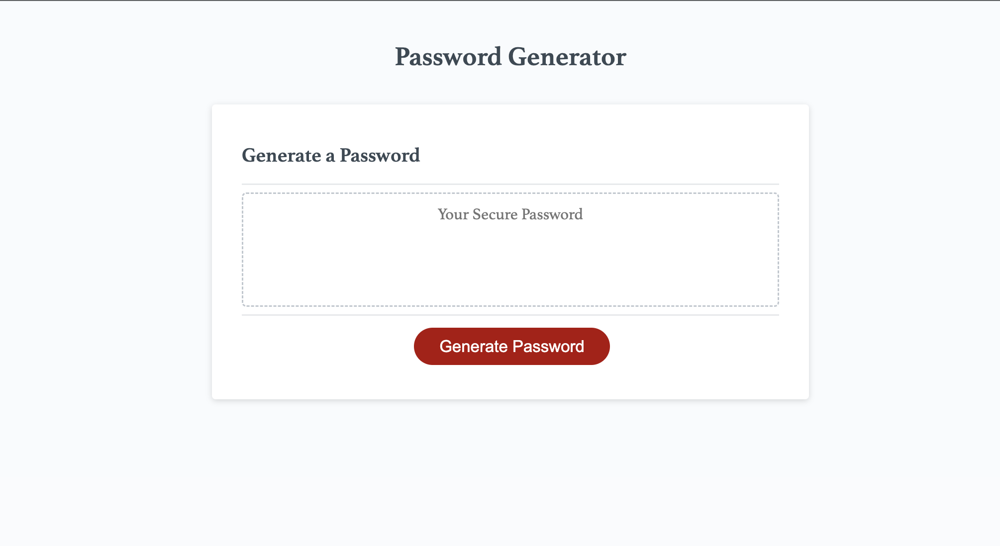

# Password Generator

## Table of Contents
- [Description](#description)
- [Link](#link)
- [Screenshot](#screenshot)

## Description
This project was created to help employees/users, with access to sensitive data, to create a randomly generated password that will provide greater security.

## Link
[Click to view my deployed portfolio GitHub Page](https://maggiemcc.github.io/generate-password/)

## Screenshot
